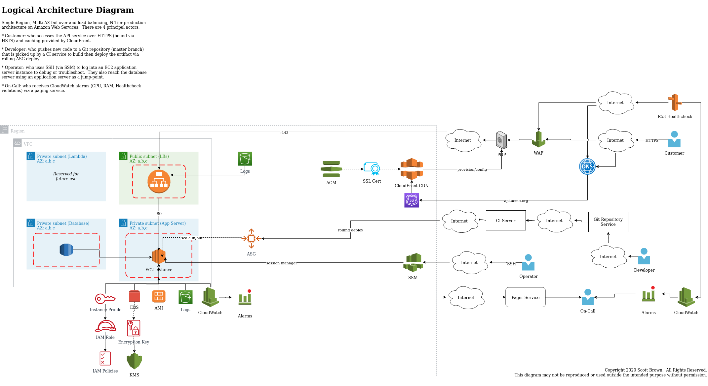

# Thinkific DevOps Take Home Test

## Notes

### Author

Scott Brown

### Date

Saturday January 11, 2020

### Location of deployed application

There is no public endpoint available to view the application.

### Time spent

7h40m hours spent on this assignment.

#### Time breakdown: 

* Dockerizing app: 
  * 2h30m: writing Docker image
  * ~1h00m: total time spent recreating the Docker image
* Adding functionality: 35m
  * Caching functionality would be handled by CloudFront (see architecture diagram) by caching the GET requests, varying on specific API_KEY headers (or something similar).  This offloads caching and processing to CloudFront and frees up the app server for more expensive workloads.  We would need to tweak the cache to ensure freshness, but it could work.
  * See note on shortcuts about rate limiting
* Architecture diagram
  * 30 mins: sketching on paper
  * 1h30m: digitizing it on draw.io and exporting a PNG file.
* Rollout Plan: 5min (see "What did you not include" section, bulletpoint 2)
* Documentation and other polishing: 1h

### Assumptions made

* The deployment of the application will be to an AWS account using the traditional ALB-EC2 architecture, using a separate database (so-called N-Tier).  Deployments are made automatically with some magical CI service outside of the AWS environment.

### Shortcuts / Compromises Made

* I did not install `rvm` in the docker container because I find shims like this complicate matters on docker or ec2 servers in a production setting (basically, anything but local developer machines).  So I installed Ruby from source and used that.
* I didn't get around to verifying the SHA-256 checksum for the Ruby source, but that is warranted since it is a third-party download.
* I would have liked to create the Docker image using `scratch` or Alpine because the resulting image was very large (~1GB), meaning AutoScaling scale-out events could become a source of timing frustration.
* I would have liked to split the Docker image into build steps, making the resulting Docker image much smaller.  For instance, I don't need a lot of the tooling around compiling code once the container has been created, so it's just cruft that takes up disk space.
* I tried to get the rate limiting working with Nginx but something isn't working, so I ripped it out of docker-compose and kept the nginx config.  I'm sure with enough time I would have figured it out.
* I would not work on `master` branch normally.  Instead, I would make small feature-related PRs and then push them for review and subsequent merging after approval.

### Stretch goals attempted

* It is unreasonable to ask an interview candidate to deploy this as a public endpoint for two reasons.  The first is that it would incur financial costs to the candidate that could lead to long-term or unbounded costs (especially in AWS).  The second is that deploying un-vetted code onto a public endpoint (there is no time to vet in the allotted 4-6 hours given) is a security issue.
* Multitenancy can be accomplished in a couple ways, the easiest being logical partitioning within the database layer.  Without more data or context about the customers or regulatory requirements in this application, it would be overkill to apply sharding or physical database separation (or even application separation) to gain multi-tenancy features.  In short, there is not enough information provided in the PDF file to make any recommendations for multi-tenancy solutions.

### Instructions to run assignment locally

* Unzip package into directory
  * This creates a directory called `foo`
* Change directory (`cd`) in newly-created directory
  * e.g. `cd foo`
* Start all services by running `[sudo] docker-compose up`
  * The services are live, but the database is empty.
* Find the `app` Docker container
  * Use `[sudo] docker ps`.  Its name will be something like devops-autoincrementing-integers-101_app`
* Enter the running Docker container by running `[sudo] docker exec -it CONTAINER_NAME bash`
  * where `CONTAINER_NAME` is the name of the running Docker container from the previous step.
* Once inside the Docker container, create the database and run all migrations
  * Create Database with `bundle exec rails db:create`
  * Run migrations with `bundle exec rails db:migrate RAILS_ENV=development`
* Open http://localhost in your Web browser

### What did you not include in your solution that you want us to know about?

* I deliberately did not include the SSL in the Docker-Compose file because I like to offload SSL onto a dedicated machine.  Having to negotiate SSL on each application server takes up valuable resources.  In an AWS environment, an ELB/ALB will provide the SSL termination, then hand-off the connection on an unencrypted channel to an EC2 instance.  This is not a security issue as VPCs are classified as private networks and while VPCs aren't necessarily encrypted (they may be as of late 2019), the passage of unencrypted data over private networks is still compliant with many regulatory compliance (but not HIPAA).  Putting SSL onto a Docker container means the Docker image will contain an SSL private key, which could be exposed at any future time and it means we would need to purchase an SSL certificate (self-signed notwithstanding).
** If I were to include SSL in docker-compose.yml, I would front the app with nginx, add a self-signed SSL cert, and then proxy pass requests from port 80 to the backend app.
* I did not create a roll-out plan as this cannot be done without knowing the existing infrastructure and its idiosyncracies.  The only solution that could be given with this few pieces of information would be to stand up the new infrastructure and use DNS to cutover at the most quiet time of the week.  The DNS propogation could take 48 hours so monitoring and syncing of data may be required during that time.

### Other information about your submission that you feel it's important that we know if applicable.

n/a

### Your feedback on this technical challenge.

This is an interesting request because there's a power dynamic here.  You are asking for feedback and some of that may be viewed as a criticism, but that could jeopardize my candidacy for this position.  At this point, it is difficult to know if there would be consequences for my honesty since a rejection is often simply a "No" without further explanation.

However, I do believe in open and honest communcation so I will provide a few pieces of feedback.  I also believe that when applying for senior level positions or higher, there are expectations that interviewers want to see respectful criticism and/or pushback with explanations.

Overall, this assignment suffers from time and effort constraints.   Completing the tasks takes more than the allotted 4-6 hours and the burden is placed on the candidate and not on Thinkific; I prefer to see more of an equal expenditure.  There is the feeling of being rushed, which I don't like because the words "production-grade" and "as detailed as possible" are being used to denote quality.  This does not simulate a real-world scenario because in a real environment pairing and help would be welcomed and if an employer wants to evaluate solving real challenges then they would be there with the candidate through the process.  While stated otherwise in the caveat, the type of tasks being requested and the request of "production-grade" quality leads me to believe candidate submissions could be used to solicit free work.

I like how this is looks like a real-world request as opposed to a toy project that some employers give.  This is a good thing.  However, where it goes wrong is that it is evaluating the candidate in all the wrong ways.  There is no point to evaluate the candidate's Docker skill set by having them wait and iterate on a docker image, but rather by creating a simple Docker image -- pull an official image, install some libraries -- or explaining to an interviewer what a given sample Dockerfile would do.  I would also like to see a greater emphasis on security as running arbitrary code as well as storage of an SSL private key in a Docker container is not advisable from a security perspective.

### Logical Architecture Diagram

